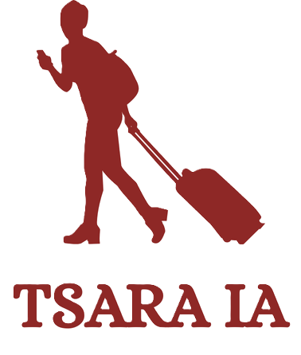
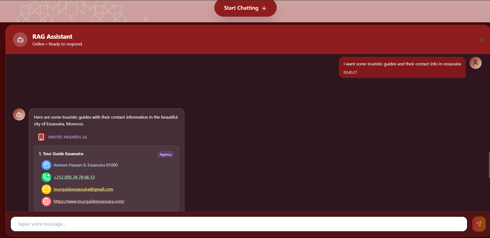
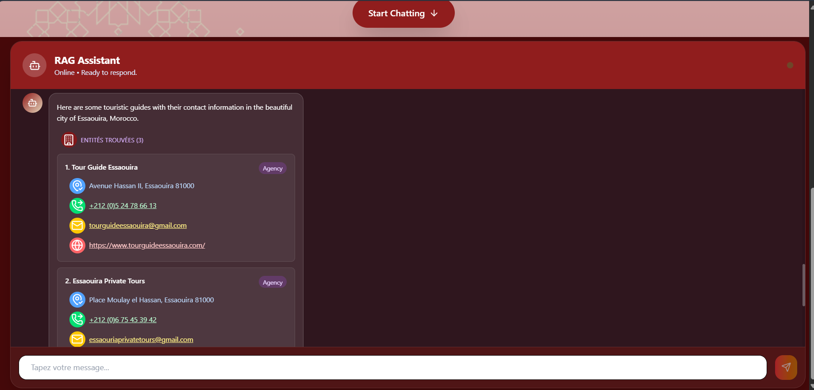
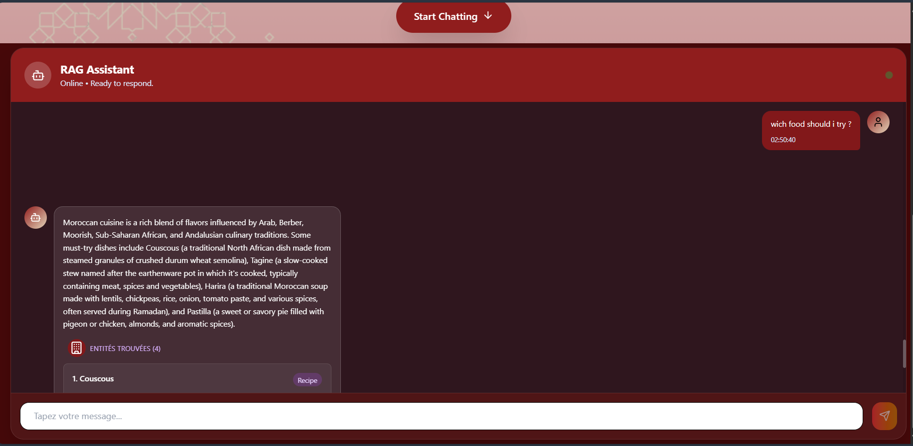
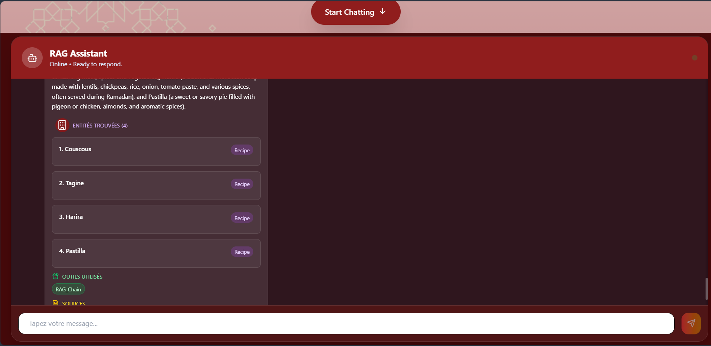

<!-- Improved compatibility of back to top link: See: https://github.com/othneildrew/Best-README-Template/pull/73 -->
<a id="readme-top"></a>
<!--
*** Thanks for checking out the Best-README-Template. If you have a suggestion
*** that would make this better, please fork the repo and create a pull request
*** or simply open an issue with the tag "enhancement".
*** Don't forget to give the project a star!
*** Thanks again! Now go create something AMAZING! :D
-->


<!-- PROJECT SHIELDS -->
<!--
*** I'm using markdown "reference style" links for readability.
*** Reference links are enclosed in brackets [ ] instead of parentheses ( ).
*** See the bottom of this document for the declaration of the reference variables
*** for contributors-url, forks-url, etc. This is an optional, concise syntax you may use.
*** https://www.markdownguide.org/basic-syntax/#reference-style-links
-->
<!-- [![Contributors][contributors-shield]][contributors-url]
[![Forks][forks-shield]][forks-url]
[![Stargazers][stars-shield]][stars-url]
[![Issues][issues-shield]][issues-url]
[![project_license][license-shield]][license-url] -->
[![LinkedIn][linkedin-shield]][linkedin-url]
[![Website][website-shield]][Website-url]


<!-- PROJECT LOGO -->
<br />
<div align="center">
  <a href="https://github.com/ourahma/repo_name">
    
  </a>

<h1 align="center" style="color:rgb(142, 40, 38);">TSARA IA</h1>
</div>


<!-- TABLE OF CONTENTS -->
<details>
  <summary>Table of Contents</summary>
  <ol>
    <li>
      <a href="#about-the-project">About The Project</a>
      <ul>
        <li><a href="#built-with">Built With</a></li>
      </ul>
    </li>
    <li>
      <a href="#getting-started">Getting Started</a>
      <ul>
        <li><a href="#prerequisites">Prerequisites</a></li>
        <li><a href="#installation">Installation</a></li>
      </ul>
    </li>
    <li><a href="#usage">Usage</a></li>
    <li><a href="#license">License</a></li>
    <li><a href="#contact">Contact</a></li>
  </ol>
</details>


<!-- ABOUT THE PROJECT -->
## Tsara.IA: Intelligent Tourism Assistant for Morocco

[![Product Name Screen Shot][product-screenshot]](https://example.com)

Tsara.IA is an AI-powered agent designed to make travel in Morocco smarter, easier, and more engaging. Built with a Retrieval-Augmented Generation (RAG) architecture, it leverages advanced LLMs, LangChain, and Hugging Face embeddings to provide context-aware answers grounded in reliable local data.

### What makes Tsara.IA unique?

* Trusted Sources: Information comes from curated datasets, including:

    * Official travel agencies across different Moroccan cities
    * Licensed tourism guides and cultural references
    * Local meals, recipes, and authentic culinary insights

* Contextual Understanding: Unlike a simple chatbot, Tsara.IA retrieves and synthesizes information from vector databases to deliver relevant, accurate, and personalized answers.

* Cutting-Edge Tech Stack:

    * `LLMs` for natural language reasoning
    * `LangChain` for orchestration and tool integration
    * `Hugging Face` embeddings for semantic search and vector retrieval
    * `ChromaDB` as the vector database.
    * `React.js` for an intuitive user interface, ensuring easy access to the system’s features and functionality.
    * `FastApi` : for a fast, reliable, and scalable backend to handle API requests efficiently.
    
* Database
    * All documents used to ensure accuracy come from reliable sources, such as [Govermental website](https://data.gov.ma/data/dataset/), and trused sources for [dataset](https://www.kaggle.com/)

<p align="right">(<a href="#readme-top">back to top</a>)</p>


### Built With

* [![React.js][React.js]][React-url]
* [![LangChain][LangChain]][LangChain-url]
* [![HuggingFace][HuggingFace]][HuggingFace-url]
* [![ChromaDB][ChromaDB]][ChromaDB-url]
* [![FastAPI][FastAPI]][FastAPI-url]
* [![Ollama][Ollama]][Ollama-url]


<p align="right">(<a href="#readme-top">back to top</a>)</p>


<!-- GETTING STARTED -->
## Getting Started

This is an example of how you may give instructions on setting up your project locally.
To get a local copy up and running follow these simple example steps.

### Prerequisites

This is an example of how to list things you need to use the software and how to install them.
* npm
  ```sh
  npm install npm@latest -g
  ```

## Installation

Follow the steps below to set up the project locally:

### Prerequisites

Make sure you have the following installed:

* **Node.js** (>= 18.x)
* **npm** or **yarn**
* **Python** (>= 3.12)
* **pip** (Python package manager)
* **uv** (Project manager)

### Clone the repository

```bash
git clone https://github.com/ourahma/TsaraIA.git
cd TsaraIA
```

### Backend Setup

1. Navigate to the backend folder:

   ```bash
   cd backend
   ```

2. (Optional) Create and activate a virtual environment:

   ```bash
   python -m venv venv
   source venv/bin/activate   # On Linux/Mac
   venv\Scripts\activate      # On Windows
   ```

3. Install dependencies:

   ```bash
   pip install -r requirements.txt
   ```

4. Set up Ollama
   * Install [Ollama](https://ollama.com/) on your machine if not already installed.
   * Ensure you have pulled and set up an LLM that supports tool usage.  
     In this project, we use **`mistral:7b`** as the default model:
     ```bash
     ollama pull mistral:7b
     ```
   * You can replace it with another model of your choice, but make sure it supports **function calling / tool integration**.

5. Run the backend server:

   ```bash
   uvicorn main:app --reload
   ```

   The backend will be available at: **[http://localhost:8000](http://localhost:8000)**

### Frontend Setup

1. Navigate to the frontend folder:

   ```bash
   cd frontend
   ```

2. Install dependencies:

   ```bash
   npm install
   ```

   or

   ```bash
   yarn install
   ```

3. Start the development server:

   ```bash
   npm run dev
   ```

   or

   ```bash
   yarn dev
   ```

   The frontend will be available at: **[http://localhost:5173](http://localhost:5173)** (default for Vite).

---

Now both backend and frontend should be running locally and connected.


<!-- USAGE EXAMPLES -->
## Usage

You can now access the frontend directly from your browser and interact with the chatbot’s user-friendly interface to ask questions and receive accurate, real-time answers.

### Ask about touristic guides :
  * Send the Chatbot your question  :


  * Receive detailed answers with information about the phone number,website, adresses ... :

  

### Ask about receipies :
    * Send the Chatbot your question :

  * Receive detailed answers with information about the phone number,website, adresses ... :

  


<p align="right">(<a href="#readme-top">back to top</a>)</p>


<!-- LICENSE -->
## License
See `LICENSE.txt` for more information.

<p align="right">(<a href="#readme-top">back to top</a>)</p>


<!-- CONTACT -->
## Contact

OURAHMA Maroua - [@Website](https://maroua-ourahma.netlify.app/) - marouaourahma@gmail.com

Project Link: [https://github.com/ourahma/TsaraIA](https://github.com/ourahma/TsaraIA)

<p align="right">(<a href="#readme-top">back to top</a>)</p>


<!-- MARKDOWN LINKS & IMAGES -->
<!-- https://www.markdownguide.org/basic-syntax/#reference-style-links -->
[contributors-shield]: https://img.shields.io/github/contributors/github_username/repo_name.svg?style=for-the-badge
[contributors-url]: https://github.com/ourahma/TsaraIA/graphs/contributors
[forks-shield]: https://img.shields.io/github/forks/github_username/repo_name.svg?style=for-the-badge
[forks-url]: https://github.com/github_username/repo_name/network/members
[stars-shield]: https://img.shields.io/github/stars/github_username/repo_name.svg?style=for-the-badge
[stars-url]: https://github.com/github_username/repo_name/stargazers
[issues-shield]: https://img.shields.io/github/issues/github_username/repo_name.svg?style=for-the-badge
[issues-url]: https://github.com/github_username/repo_name/issues
[license-shield]: https://img.shields.io/github/license/github_username/repo_name.svg?style=for-the-badge
[license-url]: https://github.com/github_username/repo_name/blob/master/LICENSE.txt
[linkedin-shield]: https://img.shields.io/badge/-LinkedIn-black.svg?style=for-the-badge&logo=linkedin&colorB=555
[website-shield]: https://img.shields.io/badge/-Website-black.svg?style=for-the-badge&logo=internet-explorer&colorB=855
[linkedin-url]: https://linkedin.com/in/maroua-ourahma
[Website-url]: https://maroua-ourahma.netlify.app/
[product-screenshot]: pics/product-screenshot.png
<!-- Shields.io badges. You can a comprehensive list with many more badges at: https://github.com/inttter/md-badges -->

[React.js]: https://img.shields.io/badge/React-20232A?style=for-the-badge&logo=react&logoColor=61DAFB
[React-url]: https://reactjs.org/
[React.js]: https://img.shields.io/badge/React-20232A?style=for-the-badge&logo=react&logoColor=61DAFB
[React-url]: https://reactjs.org/

[LangChain]: https://img.shields.io/badge/LangChain-2C3E50?style=for-the-badge&logo=chainlink&logoColor=white
[LangChain-url]: https://www.langchain.com/

[HuggingFace]: https://img.shields.io/badge/HuggingFace-FECC00?style=for-the-badge&logo=huggingface&logoColor=black
[HuggingFace-url]: https://huggingface.co/

[ChromaDB]: https://img.shields.io/badge/ChromaDB-FF6B6B?style=for-the-badge&logo=databricks&logoColor=white
[ChromaDB-url]: https://www.trychroma.com/

[FastAPI]: https://img.shields.io/badge/FastAPI-009688?style=for-the-badge&logo=fastapi&logoColor=white
[FastAPI-url]: https://fastapi.tiangolo.com/

[OpenAI]: https://img.shields.io/badge/OpenAI-412991?style=for-the-badge&logo=openai&logoColor=white
[OpenAI-url]: https://openai.com/

[Ollama]: https://img.shields.io/badge/Ollama-412991?style=for-the-badge&logo=ollama&logoColor=white
[Ollama-url]: https://ollama.com/

